# 키친포스

## 퀵 스타트

```sh
cd docker
docker compose -p kitchenpos up -d
```

## 요구 사항

### 상품

- 상품을 등록할 수 있다.
- 상품의 가격이 올바르지 않으면 등록할 수 없다.
  - 상품의 가격은 0원 이상이어야 한다.
- 상품의 이름이 올바르지 않으면 등록할 수 없다.
  - 상품의 이름에는 비속어가 포함될 수 없다.
- 상품의 가격을 변경할 수 있다.
- 상품의 가격이 올바르지 않으면 변경할 수 없다.
  - 상품의 가격은 0원 이상이어야 한다.
- 상품의 가격이 변경될 때 메뉴의 가격이 메뉴에 속한 상품 금액의 합보다 크면 메뉴가 숨겨진다.
- 상품의 목록을 조회할 수 있다.

### 메뉴 그룹

- 메뉴 그룹을 등록할 수 있다.
- 메뉴 그룹의 이름이 올바르지 않으면 등록할 수 없다.
  - 메뉴 그룹의 이름은 비워 둘 수 없다.
- 메뉴 그룹의 목록을 조회할 수 있다.

### 메뉴

- 1개 이상의 등록된 상품으로 메뉴를 등록할 수 있다.
- 상품이 없으면 등록할 수 없다.
- 메뉴에 속한 상품의 수량은 0개 이상이어야 한다.
- 메뉴의 가격이 올바르지 않으면 등록할 수 없다.
  - 메뉴의 가격은 0원 이상이어야 한다.
- 메뉴에 속한 상품 금액의 합은 메뉴의 가격보다 크거나 같아야 한다.
- 메뉴는 특정 메뉴 그룹에 속해야 한다.
- 메뉴의 이름이 올바르지 않으면 등록할 수 없다.
  - 메뉴의 이름에는 비속어가 포함될 수 없다.
- 메뉴의 가격을 변경할 수 있다.
- 메뉴의 가격이 올바르지 않으면 변경할 수 없다.
  - 메뉴의 가격은 0원 이상이어야 한다.
- 메뉴에 속한 상품 금액의 합은 메뉴의 가격보다 크거나 같아야 한다.
- 메뉴를 노출할 수 있다.
- 메뉴의 가격이 메뉴에 속한 상품 금액의 합보다 높을 경우 메뉴를 노출할 수 없다.
- 메뉴를 숨길 수 있다.
- 메뉴의 목록을 조회할 수 있다.

### 가게 테이블

- 가게 테이블을 등록할 수 있다.
- 가게 테이블의 이름이 올바르지 않으면 등록할 수 없다.
  - 가게 테이블의 이름은 비워 둘 수 없다.
- 가게 테이블 사용 여부를 설정할 수 있다.
- 가게 테이블 사용 여부를 해지할 수 있다.
- 완료되지 않은 주문이 있는 가게 테이블은 사용 여부를 해지할 수 없다.
- 가게 테이블 고객 수를 변경할 수 있다.
- 가게 테이블 고객 수가 올바르지 않으면 변경할 수 없다.
  - 가게 테이블 고객 수는 0명 이상이어야 한다.
- 사용하지 않는 가게 테이블은 방문한 고객 수를 변경할 수 없다.
- 가게 테이블의 목록을 조회할 수 있다.

### 주문

- 1개 이상의 등록된 메뉴로 배달 주문을 등록할 수 있다.
- 1개 이상의 등록된 메뉴로 포장 주문을 등록할 수 있다.
- 1개 이상의 등록된 메뉴로 매장 주문을 등록할 수 있다.
- 주문 유형이 올바르지 않으면 등록할 수 없다.
- 메뉴가 없으면 등록할 수 없다.
- 매장 주문은 주문 항목의 수량이 0 미만일 수 있다.
- 매장 주문을 제외한 주문의 경우 주문 항목의 수량은 0개 이상이어야 한다.
- 배달 주소가 올바르지 않으면 배달 주문을 등록할 수 없다.
  - 배달 주소는 비워 둘 수 없다.
- 사용하지 않는 가게 테이블에는 매장 주문을 등록할 수 없다.
- 숨겨진 메뉴는 주문할 수 없다.
- 주문한 메뉴의 가격은 실제 메뉴 가격과 일치해야 한다.
- 주문을 접수한다.
- 접수 대기 중인 주문만 접수할 수 있다.
- 배달 주문을 접수되면 배달 기사를 호출한다.
- 주문을 전달한다.
- 접수된 주문만 상품을 전달할 수 있다.
- 주문을 배달한다.
- 배달 주문만 배달할 수 있다.
- 음싱이 전달된 주문만 배달할 수 있다.
- 주문을 배달 완료한다.
- 배달 중인 주문만 배달 완료할 수 있다.
- 주문을 완료한다.
- 배달 주문의 경우 배달 완료된 주문만 완료할 수 있다.
- 포장 및 매장 주문의 경우 상품이 전달된 주문만 완료할 수 있다.
- 가게 테이블의 모든 매장 주문이 완료되면 사용하지 않는 가게 테이블로 설정한다.
- 완료되지 않은 매장 주문이 있는 가게 테이블은 사용하지 않는 테이블로 설정하지 않는다.
- 주문 목록을 조회할 수 있다.

## 용어 사전

### 공통

| 한글명 | 영문명              | 설명                          |
|-----|------------------|-----------------------------|
| 비속어 | Profanity        | - 불쾌감을 주는 상스럽고 거친 말을 의미한다.  |
| 사장님 | Restaurant Owner | - 가게를 관리하는 주체를 의미한다.        |
| 가게  | Restaurant       | - 사장님이 운영하고 관리하는 음식점을 의미한다. |
| 고객  | Customer         | - 주문을 하는 주체를 의미한다.          |

### 상품

| 한글명   | 영문명           | 설명                                                                               |
|-------|---------------|----------------------------------------------------------------------------------|
| 상품    | Product       | - 상품이나 상품의 단위로 메뉴를 구성할 때 사용된다.                                                   |
| 상품 가격 | Product Price | - 상품의 가격을 의미한다. <br/>- 상품 가격은 0원 이상이어야 합니다.                                      |
| 상품 이름 | Product Name  | - 상품의 이름을 의미한다. <br/>-  상품 이름은 1자 이상이어야 합니다. <br/>-  상품 이름은 비속어나 욕설을 사용할 수 없습니다. |

### 메뉴 그룹

| 한글명      | 영문명            | 설명                                                 |
|----------|----------------|----------------------------------------------------|
| 메뉴 그룹    | MenuGroup      | - 메뉴의 집합을 의미한다.                                    |
| 메뉴 그룹 이름 | MenuGroup Name | - 메뉴의 집합 이름을 의미한다. <br/>-  메뉴 집합 이름은 1자 이상이어야 합니다. |

### 메뉴

| 한글명      | 영문명            | 설명                                                                                 |
|----------|----------------|------------------------------------------------------------------------------------|
| 메뉴       | Menu           | - 사장님 시점 : 고객에게 제공하는 상품의 판매 단위이다. <br/>- 고객 시점 : 고객이 주문하는 상품의 판매 단위이다.             |
| 메뉴 상품    | Menu Product   | - 메뉴를 구성하는 상품을 의미한다.                                                               |
| 메뉴 가격    | Menu Price     | - 메뉴의 단위 가격을 의미한다. <br/>- 메뉴 가격은 0원 이상이어야 합니다. <br/>- 메뉴를 구성하는 메뉴 상품의 총합을 넘을 수 없다. |
| 메뉴 이름    | Menu Name      | - 메뉴의 이름을 의미한다. <br/>- 메뉴 이름은 1자 이상이어야 합니다. <br/>- 메뉴 이름은 비속어나 욕설을 사용할 수 없습니다.     |
| 메뉴 노출 상태 | Menu Displayed | - 메뉴를 고객에게 노출 시키는 상태를 의미한다. (노출/숨김)                                                |
| 노출 메뉴    | Displayed Menu | - 고객에게 노출된 메뉴를 의미한다.                                                               |
| 숨김 메뉴    | Hide Menu      | - 고객에게 숨겨진 메뉴를 의미한다.                                                               |

### 주문

| 한글명         | 영문명                        | 설명                                                     |
|-------------|----------------------------|--------------------------------------------------------|
| 주문          | Order                      | - 메뉴를 구매하기 위한 행위이다.                                    |
| 주문 항목       | Order Line Item            | - 주문에서 요청한 메뉴를 나타내는 항목을 의미한다.                          |
| 주문 항목 메뉴    | Order Line Item Menu       | - 주문 항목에서 요청한 메뉴를 의미한다.                                |
| 주문 항목 메뉴 가격 | Order Line Item Menu Price | - 주문 항목에서 요청한 메뉴의 가격을 의미한다.                            |
| 주문 항목 메뉴 이름 | Order Line Item Menu Name  | - 주문 항목에서 요청한 메뉴의 이름을 의미한다.                            |
| 주문 항목 수량    | Order Line Item Quantity   | - 주문 항목의 단위 수량을 의미한다.                                  |
| 주문 항목 가격    | Order Line Item Price      | - 주문 항목의 단위 가격을 의미한다.                                  |
| 주문 금액       | Order Price                | - 주문에 대한 금액을 의미한다. <br/>- 주문에 대한 금액은 주문 항목의 총 합산 금액이다. |
| 주문 시간       | Order Date Time            | - 주문 요청을 생성한 시각(년월일시분초)을 의미한다.                         |
| 주문 상태       | Order Status               | - 주문의 진행 상태를 의미한다. <br/>(대기중, 접수됨, 전달됨, 배달중, 배달됨, 완료됨) |
| 주문 유형       | Order Type                 | - 주문 유형을 의미한다.                                         |
| 배달 주문       | Delivery Order             | - 상품 배달 서비스를 위한 주문을 의미한다.                              |
| 매장 주문       | EatIn Order                | - 매장 내 식사 서비스를 위한 주문을 의미한다.                            |
| 포장 주문       | Takeout Order              | - 매장 외 식사 서비스를 위한 주문을 의미한다.                            |

### 배달 주문

| 한글명   | 영문명              | 설명                                      |
|-------|------------------|-----------------------------------------|
| 배달 주소 | Delivery Address | - 배달 받을 주소를 의미한다.                       |
| 대기중   | Waiting          | - 고객이 주문을 했음을 의미한다.                     |
| 접수됨   | Accepted         | - 가게 사장님이 주문을 접수했음을 의미한다.               |
| 전달됨   | Served           | - 가게 사장님이 상품을 전달했음을 의미한다.               |
| 배달중   | Delivering       | - 배달 기사가 상품을 고객에게 배달 중임을 의미한다.          |
| 배달됨   | Delivered        | - 상품이 고객에게 배달됨을 의미한다.                   |
| 완료됨   | Completed        | - 배달 주문 과정이 완료됨을 의미한다.                  |
| 배달 기사 | Delivery Rider   | - 배달을 담당하는 주체로, 사장님에게 상품을 받아 고객에게 전달한다. |

### 매장 주문

| 한글명 | 영문명       | 설명                        |
|-----|-----------|---------------------------|
| 대기중 | Waiting   | - 고객이 주문을 했음을 의미한다.       |
| 접수됨 | Accepted  | - 가게 사장님이 주문을 접수했음을 의미한다. |
| 전달됨 | Served    | - 가게 사장님이 상품을 전달했음을 의미한다. |
| 완료됨 | Completed | - 매장 주문 과정이 완료됨을 의미한다.    |

### 포장 주문

| 한글명 | 영문명       | 설명                        |
|-----|-----------|---------------------------|
| 대기중 | Waiting   | - 고객이 주문을 했음을 의미한다.       |
| 접수됨 | Accepted  | - 가게 사장님이 주문을 접수했음을 의미한다. |
| 전달됨 | Served    | - 가게 사장님이 상품을 전달했음을 의미한다. |
| 완료됨 | Completed | - 포장 주문 과정이 완료됨을 의미한다.    |

### 가게 테이블

| 한글명          | 영문명                            | 설명                                             |
|--------------|--------------------------------|------------------------------------------------|
| 가게 테이블       | Restaurant Table               | - 가게의 테이블을 의미한다.                               |
| 가게 테이블 이름    | Restaurant Table Name          | - 테이블의 이름을 의미한다. 1번, 2번 등 번호로 테이블 이름을 부르기도 한다. |
| 가게 테이블 사용 상태 | Restaurant Occupied            | - 테이블을 사용중인지를 의미한다.                            |
| 사용중인 가게 테이블  | Occupied Restaurant Table      | - 고객이 사용중인 테이블을 나타낸다.                          |
| 미사용중인 가게 테이블 | UnOccupied Restaurant Table    | - 미사용 테이블을 나타낸다.                               |
| 가게 테이블 고객 수  | Restaurant Table numberOfGuest | - 해당 테이블을 사용중인 고객 수를 의미한다.                     |

## 모델링

### 상품

- 상태
  - 상품 가격을 가진다.
    - 상품 가격은 0원 이상 이어야 한다.
  - 상품 이름을 가진다.
    - 상품 이름은 공백으로 비워둘 수 없다.
    - 상품 이름에는 비속어가 포함될 수 없으며, 비속어 검증은 외부 솔루션을 이용한다.
- 행위
  - 상품 가격을 등록할 수 있다.
  - 상품 가격을 변경할 수 있다.
  - 상품 이름을 등록할 수 있다.
  - 상품 목록을 조회할 수 있다.

#### 시각화 모델링

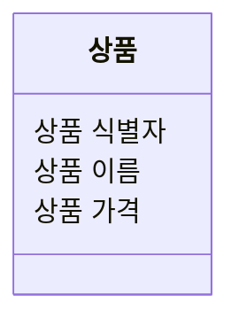

#### 클래스 모델링

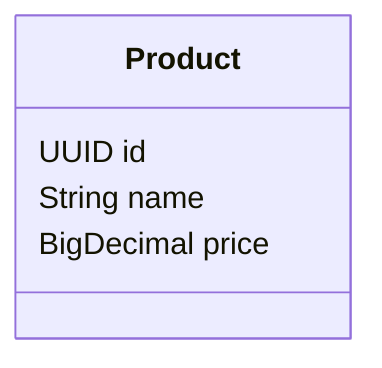

### 메뉴 그룹

- 상태
  - 메뉴 그룹 이름을 가진다.
    - 메뉴 그룹 이름은 공백으로 비워둘 수 없다.
- 행위
  - 메뉴 그룹 이름을 등록할 수 있다.
  - 메뉴 그룹 목록을 조회할 수 있다.

#### 시각화 모델링

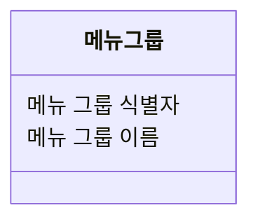

#### 클래스 모델링

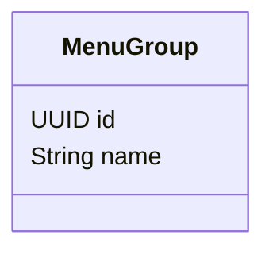

### 메뉴

- 상태
  - 메뉴 이름을 가진다.
    - 메뉴 이름은 공백으로 비워둘 수 없다.
    - 메뉴 이름에는 비속어가 포함될 수 없으며, 비속어 검증은 외부 솔루션을 이용한다.
  - 메뉴 가격을 가진다.
    - 메뉴 가격은 0원 이상이어야 한다.
  - 메뉴 노출 상태를 가진다.
    - 메뉴 노출 상태는 `노출`, `숨김`을 사용한다.
  - 메뉴 그룹을 가진다.
  - 메뉴 상품을 가진다.
    - 메뉴 상품의 수량은 0개 이상이어야 한다.
    - 메뉴 가격이 메뉴에 속한 메뉴 상품 금액의 합보다 높을 경우 메뉴를 노출할 수 없다.
    - 메뉴에 속한 메뉴 상품 금액의 합은 메뉴의 가격보다 크거나 같아야 한다.
- 행위
  - 메뉴 이름을 등록할 수 있다.
  - 메뉴 가격을 등록할 수 있다.
  - 메뉴 가격을 변경할 수 있다.
  - 메뉴 상태를 `노출` 처리할 수 있다.
  - 메뉴 상태를 `숨김` 처리할 수 있다.
  - 메뉴 목록을 조회할 수 있다.

#### 시각화 모델링

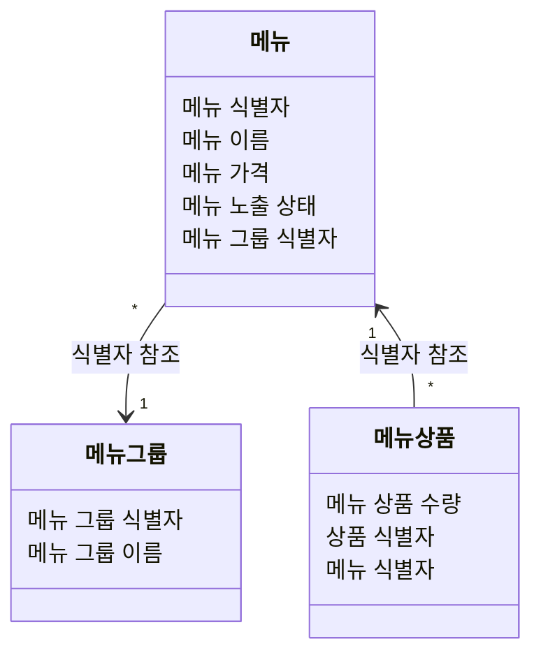

#### 클래스 모델링

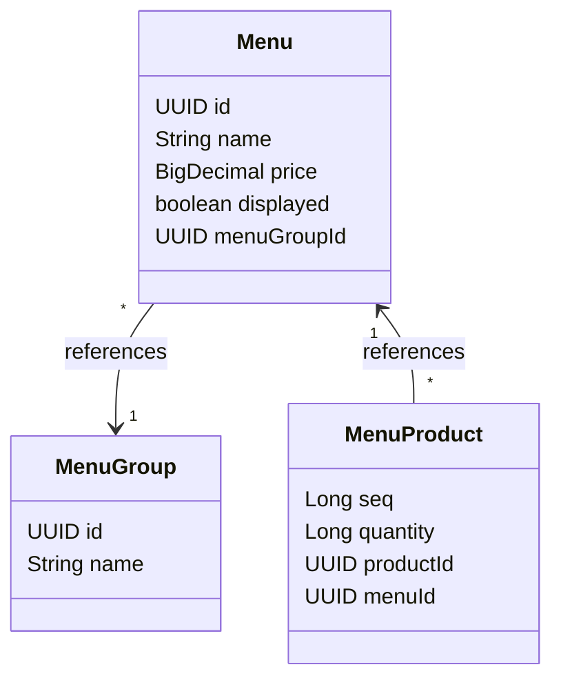

### 주문

- 상태
  - 주문 유형을 가진다. ( `배달 주문`, `매장 주문`, `포장 주문`을 사용한다.)
    - 주문 유형이 올바르지 않으면 등록할 수 없다.
    - 주문 유형은 `배달 주문`, `매장 주문`, `포장 주문`을 사용한다.
  - 주문 항목을 가진다.
    - 주문 메뉴가 없으면 등록할 수 없다.
    - 숨겨진 주문 메뉴는 주문할 수 없다.
    - 주문 메뉴의 가격은 실제 메뉴 가격과 일치해야 한다.
  - 주문 상태를 가진다.
    - 주문이 등록되면 `대기중`으로 상태가 변경된다.
    - `대기중` 상태인 주문만 `접수됨`으로 상태를 변경할 수 있다.
    - 주문이 접수되면 `접수됨`으로 상태가 변경된다.
    - `접수됨` 상태인 주문만 `전달됨` 으로 상태를 변경할 수 있다.
    - 주문 메뉴가 전달되면 `전달됨`으로 상태가 변경된다.
- 행위
  - 주문을 등록할 수 있고 주문 상태는 `대기중`이 된다.
  - 사장님은 주문을 접수할 수 있고, 주문 상태는 `접수됨`이 된다.
  - 사장님은 주문 메뉴를 전달할 수 있고, 주문 상태는 `전달됨`이 된다.
  - 주문 과정이 완료되면, 주문 상태는 `완료됨`이 된다.
  - 주문 목록을 조회할 수 있다.

#### 시각화 모델링

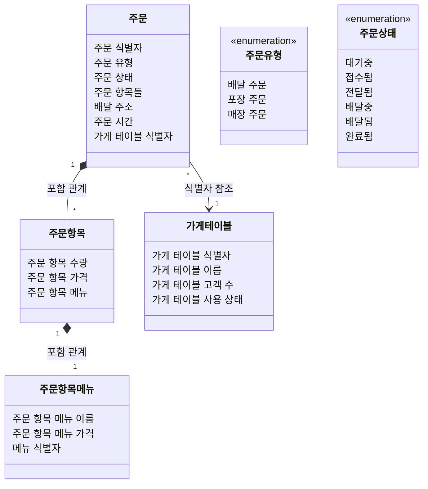

#### 클래스 모델링

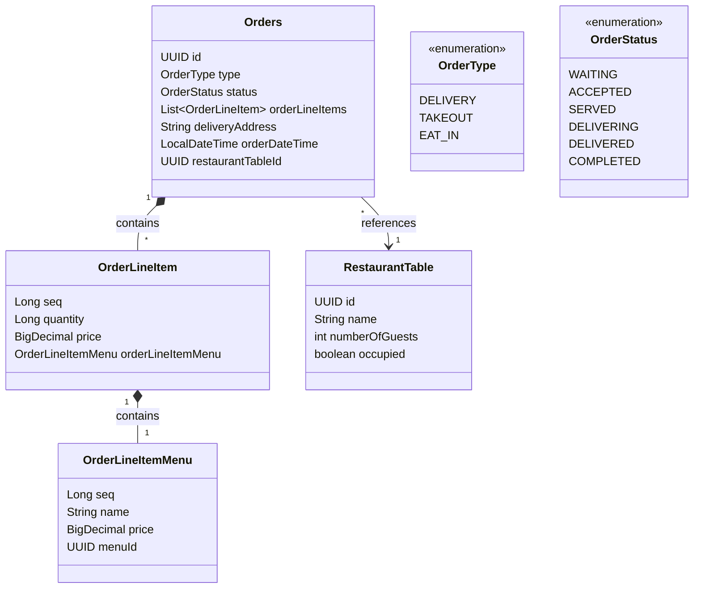

### 배달 주문

- 상태
  - 배달 주문 유형을 가진다.
    - 주문 유형이 `배달 주문`이어야 한다.
  - 배달 주소를 가진다.
    - 배달 주소는 비워 둘 수 없다.
  - 배달 주문 상태를 가진다. (`대기중(WAITING)`→`접수됨(ACCEPTED)`→`전달됨(SERVED)`→`배달중(DELIVERING)`->
    `배달됨(DELIVERED)`→`완료됨(COMPLETED)` 순서로 변경된다.)
    - 상품이 전달된 주문만 `배달중`으로 상태를 변경할 수 있다.
    - 상품이 전달되면 `배달중`으로 상태가 변경된다.
    - `배달중`상태인 주문만 `배달됨`으로 상태를 변경할 수 있다.
    - 배달이 완료되면 `배달됨`으로 상태가 변경된다.
    - `배달됨` 상태인 주문만 `완료됨` 으로 상태를 변경할 수 있다.
- 행위
  - 배달 주문을 등록할 수 있다.
  - 배달 주문이 접수되면 배달 기사를 호출할 수 있고, 배달 주문 상태가 `접수됨`이 된다.
  - 배달 기사가 주문을 배달할 수 있고, 배달 주문 상태가 `배달중`이 된다.
  - 배달 기사가 주문을 완료할 수 있고, 배달 주문 상태가 `배달됨`이 된다.

#### 배달 주문 요청 시나리오

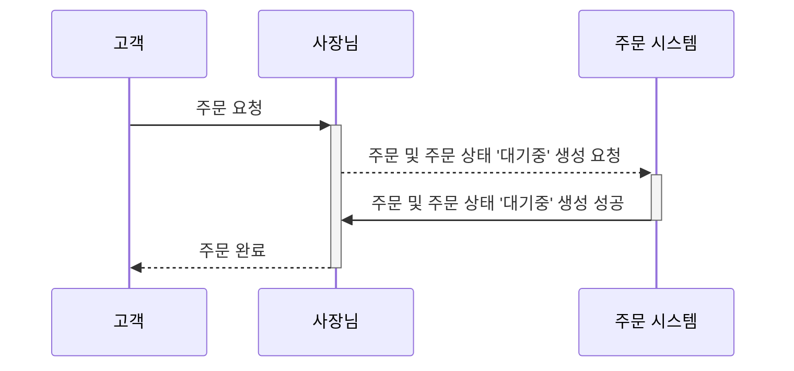

#### 배달 주문 접수 시나리오

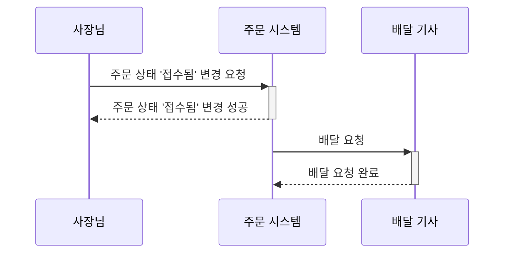

#### 배달 주문 전달 시나리오

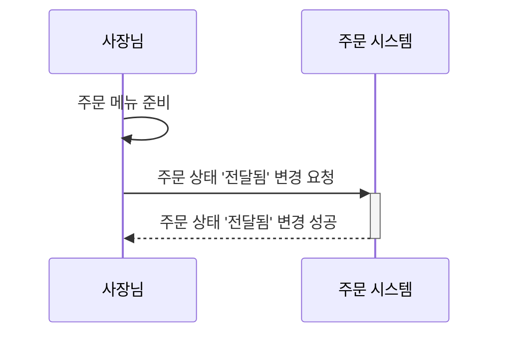

#### 배달 주문 배달 시나리오

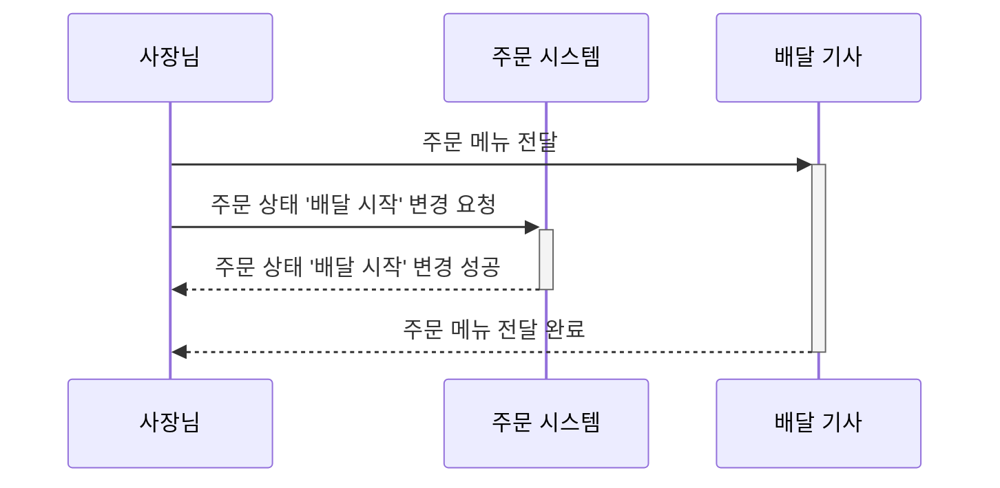

#### 배달 주문 배달 완료 시나리오

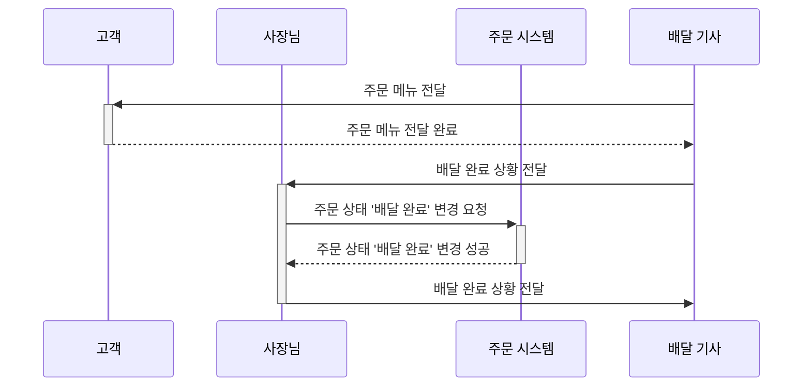

#### 배달 주문 완료 시나리오

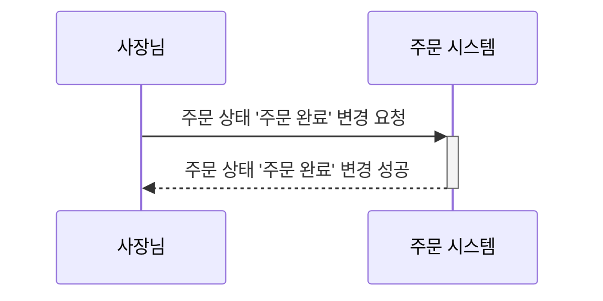

#### 배달 주문 전체 시나리오

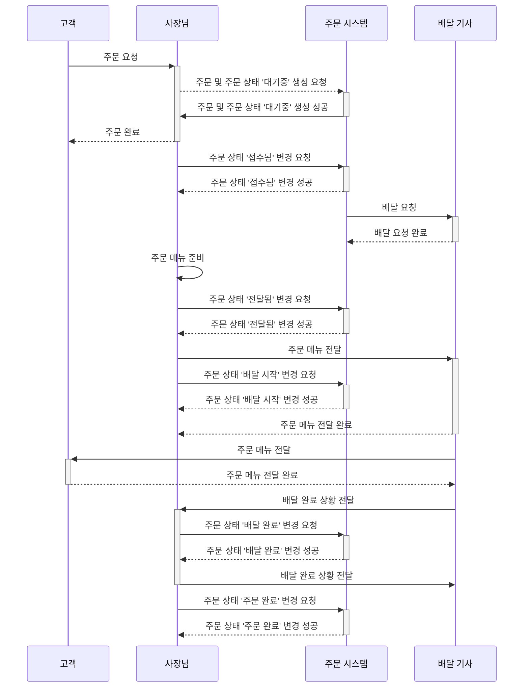

#### 배달 주문 상태 흐름도

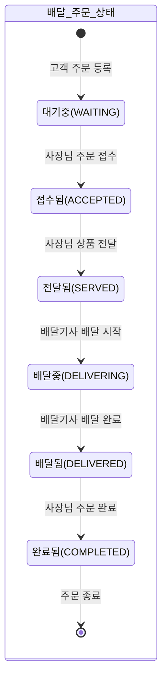

### 포장 주문

- 상태
  - 포장 주문 유형을 가진다.
    - 주문 유형이 `포장 주문`이어야 한다.
  - 포장 주문 상태를 가진다. (`대기중(WAITING)`→`접수됨(ACCEPTED)`→`전달됨(SERVED)`→`완료됨(COMPLETED)` 순서로 변경된다.)
    - 포장 주문이 등록되면 `대기중`으로 상태가 변경된다.
    - `대기중` 상태인 포장 주문만 `접수됨`으로 상태를 변경할 수 있다.
    - 포장 주문이 접수되면 `접수됨`으로 상태가 변경된다.
    - `접수됨` 상태인 포장 주문만 `전달됨` 으로 상태를 변경할 수 있다.
    - 포장 주문 메뉴가 전달되면 `전달됨`으로 상태가 변경된다.
    - 상품이 전달된 포장 주문만 `완료됨` 으로 상태를 변경할 수 있다.
- 행위
  - 포장 주문을 등록할 수 있고, 포장 주문 상태는 `대기중`이 된다.
  - 사장님은 포장 주문을 접수할 수 있고, 포장 주문 상태는 `접수됨`이 된다.
  - 사장님은 포장 주문 메뉴를 전달할 수 있고, 포장 주문 상태는 `전달됨`이 된다.
  - 포장 주문 과정이 완료되면, 포장 주문 상태는 `완료됨`이 된다.
  - 포장 주문 목록을 조회할 수 있다.

#### 포장 주문 요청 시나리오


#### 포장 주문 접수 시나리오

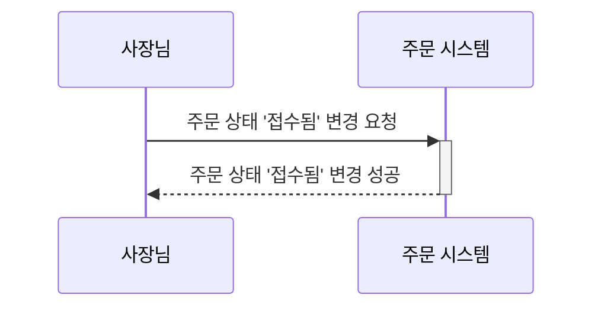

#### 포장 주문 전달 시나리오


#### 포장 주문 완료 시나리오

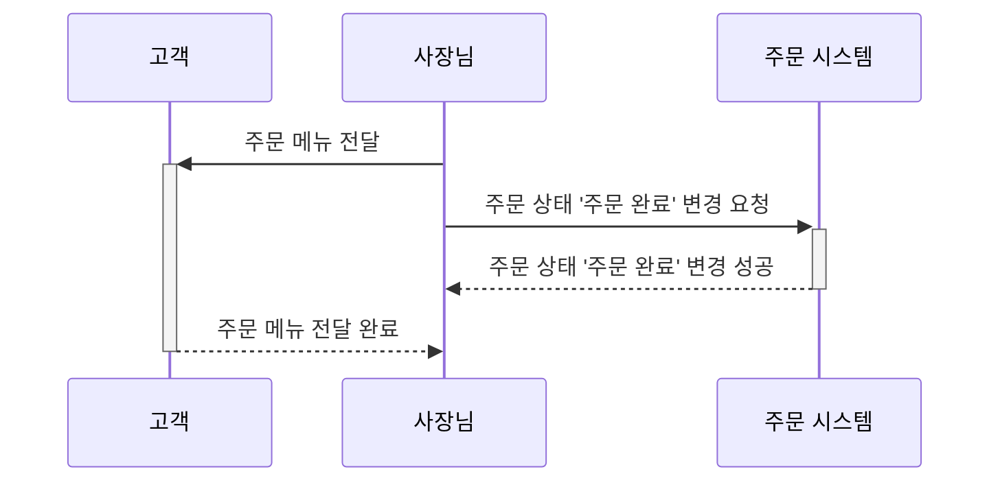

#### 포장 주문 전체 시나리오

```mermaid
sequenceDiagram
    participant Customer as 고객
    participant RestaurantOwner as 사장님
    participant System as 주문 시스템
    
    Customer->>+RestaurantOwner: 주문 요청
    RestaurantOwner-->>+System: 주문 및 주문 상태 '대기중' 생성 요청
    System->>-RestaurantOwner: 주문 및 주문 상태 '대기중' 생성 성공
    RestaurantOwner-->>-Customer: 주문 완료
    RestaurantOwner->>+System: 주문 상태 '접수됨' 변경 요청
    System-->>-RestaurantOwner: 주문 상태 '접수됨' 변경 성공 
    
    RestaurantOwner->>RestaurantOwner: 주문 메뉴 준비    
    RestaurantOwner->>+System: 주문 상태 '전달됨' 변경 요청
    System-->>-RestaurantOwner: 주문 상태 '전달됨' 변경 성공
    RestaurantOwner->>+Customer: 주문 메뉴 전달
    RestaurantOwner->>+System: 주문 상태 '주문 완료' 변경 요청
    System-->>-RestaurantOwner: 주문 상태 '주문 완료' 변경 성공 
    Customer-->>-RestaurantOwner: 주문 메뉴 전달 완료
```

#### 포장 주문 상태 흐름도

```mermaid
stateDiagram-v2
    state 포장_주문_상태 {
        [*] --> 대기중(WAITING) : 고객 주문 등록
        대기중(WAITING) --> 접수됨(ACCEPTED) : 사장님 주문 접수
        접수됨(ACCEPTED) --> 전달됨(SERVED) : 사장님 상품 전달
        전달됨(SERVED) --> 완료됨(COMPLETED) : 사장님 주문 완료
        완료됨(COMPLETED) --> [*] : 주문 종료
    }
```

### 매장 주문

- 상태
  - 포장 주문 유형을 가진다.
    - 주문 유형이 `매장 주문`이어야 한다.
  - 가게 테이블을 가진다.
    - 사용하지 않는 가게 테이블에는 매장 주문을 등록할 수 없다.
  - 매장 주문 상태를 가진다. (`대기중(WAITING)`→`접수됨(ACCEPTED)`→`전달됨(SERVED)`→`완료됨(COMPLETED)` 순서로 변경된다.)
    - `완료됨` 으로 상태이면, 가게 테이블을 `미사용` 설정할 수 있다.
    - 상품이 전달된 주문만 `완료됨` 으로 상태를 변경할 수 있다.
    - `대기중` 상태인 매장 주문만 `접수됨`으로 상태를 변경할 수 있다.
    - 매장 주문이 접수되면 `접수됨`으로 상태가 변경된다.
    - `접수됨` 상태인 매장 주문만 `전달됨` 으로 상태를 변경할 수 있다.
    - 매장 주문 메뉴가 전달되면 `전달됨`으로 상태가 변경된다.
    - 상품이 전달된 매장 주문만 `완료됨` 으로 상태를 변경할 수 있다.
- 행위
  - 매장 주문을 등록할 수 있다.
  - 가게 테이블을 `사용` 설정할 수 있다.
  - 가게 테이블을 `미사용` 설정할 수 있다.
  - 사장님은 매장 주문을 접수할 수 있고, 매장 주문 상태는 `접수됨`이 된다.
  - 사장님은 매장 주문 메뉴를 전달할 수 있고, 매장 주문 상태는 `전달됨`이 된다.
  - 매장 주문 과정이 완료되면, 매장 주문 상태는 `완료됨`이 된다.
  - 매장 주문 목록을 조회할 수 있다.

#### 가게 테이블 사용 시나리오

```mermaid
sequenceDiagram
    participant Customer as 고객
    participant RestaurantOwner as 사장님
    participant System as 주문 시스템
    
    Customer->>Customer: 가게 방문
    Customer->>+RestaurantOwner: 가게 테이블 사용 요청
    RestaurantOwner-->>+System: 가게 테이블 '사용중' 상태 변경 요청 
    System-->>-RestaurantOwner: 가게 테이블 '사용중' 상태 변경 요청 완료
    RestaurantOwner-->>-Customer: 가게 테이블 사용 요청 완료 
```

#### 가게 테이블 고객 수 변경 시나리오

```mermaid
sequenceDiagram
    participant RestaurantOwner as 사장님
    participant System as 주문 시스템
  
    RestaurantOwner->>System: 가게 테이블 '고객 수' 변경 요청 
    System-->>RestaurantOwner: 가게 테이블 '고객 수' 변경 요청 완료
```

#### 매장 주문 요청 시나리오

```mermaid
sequenceDiagram
    participant Customer as 고객
    participant RestaurantOwner as 사장님
    participant System as 주문 시스템
    
    Customer->>+RestaurantOwner: 주문 요청
    RestaurantOwner-->>+System: 주문 및 주문 상태 '대기중' 생성 요청
    System->>-RestaurantOwner: 주문 및 주문 상태 '대기중' 생성 성공
    RestaurantOwner-->>-Customer: 주문 완료  
```

#### 매장 주문 접수 시나리오

```mermaid
sequenceDiagram
    participant RestaurantOwner as 사장님
    participant System as 주문 시스템
    
    RestaurantOwner->>+System: 주문 상태 '접수됨' 변경 요청
    System-->>-RestaurantOwner: 주문 상태 '접수됨' 변경 성공 
```

#### 매장 주문 전달 시나리오

```mermaid
sequenceDiagram
    participant RestaurantOwner as 사장님
    participant System as 주문 시스템
   
    RestaurantOwner->>RestaurantOwner: 주문 메뉴 준비    
    RestaurantOwner->>+System: 주문 상태 '전달됨' 변경 요청
    System-->>-RestaurantOwner: 주문 상태 '전달됨' 변경 성공
```

#### 매장 주문 완료 시나리오

```mermaid
sequenceDiagram
    participant Customer as 고객
    participant RestaurantOwner as 사장님
    participant System as 주문 시스템
    
    RestaurantOwner->>+Customer: 주문 메뉴 전달
    RestaurantOwner->>+System: 주문 상태 '주문 완료' 변경 요청
    System-->>-RestaurantOwner: 주문 상태 '주문 완료' 변경 성공 
    Customer-->>-RestaurantOwner: 주문 메뉴 전달 완료
```

#### 모든 매장 주문 완료시 가게 테이블 사용 해지 시나리오

```mermaid
sequenceDiagram
    participant Customer as 고객
    participant RestaurantOwner as 사장님
    participant System as 주문 시스템

    Customer->>Customer: 가게 퇴장
    RestaurantOwner->>+System: 가게 테이블 사용 해지 요청
    System-->>-RestaurantOwner: 가게 테이블 사용 해지 요청 완료  
```

#### 매장 주문 전체 시나리오

```mermaid
sequenceDiagram
    participant Customer as 고객
    participant RestaurantOwner as 사장님
    participant System as 주문 시스템
    
    Customer->>Customer: 가게 방문
    Customer->>+RestaurantOwner: 가게 테이블 사용 요청
    RestaurantOwner-->>+System: 가게 테이블 '사용중' 상태 변경 요청 
    System-->>-RestaurantOwner: 가게 테이블 '사용중' 상태 변경 요청 완료
    RestaurantOwner-->>-Customer: 가게 테이블 사용 요청 완료
    
    RestaurantOwner->>System: 가게 테이블 '고객 수' 변경 요청 
    System-->>RestaurantOwner: 가게 테이블 '고객 수' 변경 요청 완료
    
    loop 매장 주문 요청
    Customer->>+RestaurantOwner: 주문 요청
    RestaurantOwner-->>+System: 주문 및 주문 상태 '대기중' 생성 요청
    System->>-RestaurantOwner: 주문 및 주문 상태 '대기중' 생성 성공
    RestaurantOwner-->>-Customer: 주문 완료
    RestaurantOwner->>+System: 주문 상태 '접수됨' 변경 요청
    System-->>-RestaurantOwner: 주문 상태 '접수됨' 변경 성공 
    
    RestaurantOwner->>RestaurantOwner: 주문 메뉴 준비    
    RestaurantOwner->>+System: 주문 상태 '전달됨' 변경 요청
    System-->>-RestaurantOwner: 주문 상태 '전달됨' 변경 성공
    RestaurantOwner->>+Customer: 주문 메뉴 전달
    RestaurantOwner->>+System: 주문 상태 '주문 완료' 변경 요청
    System-->>-RestaurantOwner: 주문 상태 '주문 완료' 변경 성공 
    Customer-->>-RestaurantOwner: 주문 메뉴 전달 완료
    end
    Customer->>Customer: 가게 퇴장
    RestaurantOwner->>+System: 가게 테이블 사용 해지 요청
    System-->>-RestaurantOwner: 가게 테이블 사용 해지 요청 완료  
```

#### 매장 주문 상태 흐름도

```mermaid
stateDiagram-v2
    state 매장_주문_상태 {
        [*] --> 대기중(WAITING) : 고객 주문 등록
        대기중(WAITING) --> 접수됨(ACCEPTED) : 사장님 주문 접수
        접수됨(ACCEPTED) --> 전달됨(SERVED) : 사장님 상품 전달
        전달됨(SERVED) --> 완료됨(COMPLETED) : 사장님 주문 완료
        완료됨(COMPLETED) --> [*] : 주문 종료
    }
```

### 가게 테이블

- 상태
  - 이름을 가진다.
    - 가게 테이블의 이름은 비워 둘 수 없다.
  - 사용 여부를 가진다.
    - 사용하지 않는 가게 테이블에는 매장 주문을 등록할 수 없다.
    - 주문이 `완료됨` 으로 상태가 될 때까지 가게 테이블을 `사용 해지`할 수 없다.
  - 고객 수 정보를 가진다.
    - 가게 테이블은 고객 수는 0명 이상이어야 한다.
    - `사용 해지`인 가게 테이블은 고객 수를 변경할 수 없다.
- 행위
  - 가게 테이블을 등록할 수 있다.
  - 가게 테이블을 `사용 설정`할 수 있다.
  - 가게 테이블을 `사용 해지`할 수 있다.
  - 가게 테이블 목록을 조회할 수 있다.

#### 시각화 모델링

```mermaid
classDiagram
    class 가게 테이블 {
        가게 테이블 식별자
        가게 테이블 이름 
        가게 테이블 고객 수 
        가게 테이블 사용 상태
    }
```

#### 클래스 모델링

```mermaid
classDiagram
    class RestaurantTable {
        UUID id
        String name
        int numberOfGuests
        boolean occupied
    }
```
